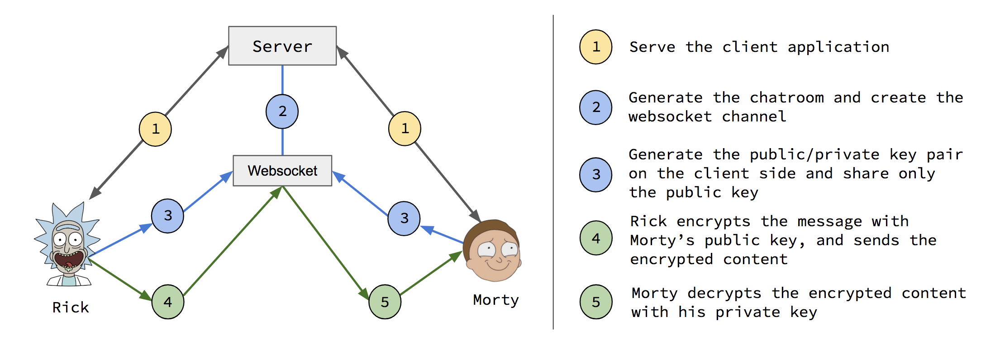

# nothing.chat
Generates channels on demand and destroys itself when the participants leave.  The content encryption scheme utilizes client-side generated public-key cryptography with the server acting as a simple relay.

## Scheme

* Rick and Morty generate public/private key pairs on the client
* Rick and Morty shares the public keys with each other
* Rick encrypts the message with Morty's public key
* Rick transmits the encrypted message over websocket
* Morty decrypts the message with his private key

### _Alternative_: Shared Public/Private Key Pair
* Rick and Morty generate the key pairs on the client
* Rick and Morty share the public keys with each other
* Rick generates another key pair and encrypts it with Morty's public key
* Rick sends the encrypted key pair to Morty
* Morty decrypts the encrypted shared key pair
* Rick encrypts a message with the shared public key
* Morty decrypts the message with the shared private key

## Walkthrough
* Initialization
  * Rick
    * Rick lands on the homepage at `/`
    * Rick clicks "Generate Room"
    * Client asks the server to create a room
    * Server generates the room
      * Checks if the room already exists
      * Generates `chatId` and sends it to the client
    * Rick sends `https://nothing.chat/c/:chatId` to Morty and Summer over another medium
    * Rick visits `https://nothing.chat/c/:chatId`
    * Server responds with the client chat application
      * Server sends `:chatId` in the response
      * Server creates a websocket channel with `:chatId`
    * Client Initialization
      * Render chat UI
      * Authenticate and subscribe to `:chatId` websocket channel ([socketio-auth](https://github.com/facundoolano/socketio-auth))
      * Generate public/private key pair
      * Send the public key to the server over `:chatId` channel
      * Note: Set `Content-Security-Policy : connect-src 'self'` ([Explanation](https://gist.github.com/subudeepak/9897212))
    * Server receives Rick's public key
  * Morty
    * Morty visits `https://nothing.chat/c/:chatId`
    * Server responds with the client chat application
      * Follow the same client initialization as Rick
      * Subscribe to `:chatId` channel over websocket
    * Server receives Morty's public key
    * Server broadcasts Rick and Morty's key to `:chatId` channel (`publicKeys` event)
  * Summer
    * Summer visits `https://nothing.chat/c/:chatId`
    * Initialize Summer's client
    * Server receives Summer's public key and re-broadcasts all keys
    * One of the participants locks the room
  * Jerry
    * Server does not accept any more connections
* Messaging
  * Rick
    * Rick generates a message
    * The message is encrypted with Morty's public key
      * The client sends the encrypted to `:chatId` channel `message` event.
    * The message is encrypted with Summer's public key
      * The client sends the encrypted to `:chatId` channel `message` event.
  * Morty
    * Morty receives the encrypted content from Rick over websocket
    * Morty decrypts the message with his private key
  * Summer
    * Summer receives the encrypted content from Rick over websocket
    * Summer decrypts the message with her private key

### _Alternate_: Shared Public/Private Key Pair
* Rick creates the room and Morty joins it
* Follow standard client initialization
* Shared Public/Private Key Pair:
  * Rick (or Morty) generates another public/private key pair
  * Rick encrypts the key pair with Morty's public key
  * Rick broadcasts the encrypted key pair to the channel
  * Morty receives decrypts the encrypted key pair
  * Now the key pair is only shared between Rick and Morty
* Rick generates a message and encrypts it with the shared public key
* Morty receives the message and decrypts it with the shared private key

## Tasks
* [x] Setup React skeleton
* [x] Setup Node skeleton
* [x] Setup Socket.io skeleton ([PR #3](https://github.com/kevinkiklee/nothing.chat/pull/3))
* [ ] Research JavaScript client-side encryption
* [ ] Research public key discovery process
* [ ] Setup HTTPS
* [ ] Setup WSS (`wss://`)
* [ ] Research hosting solution
